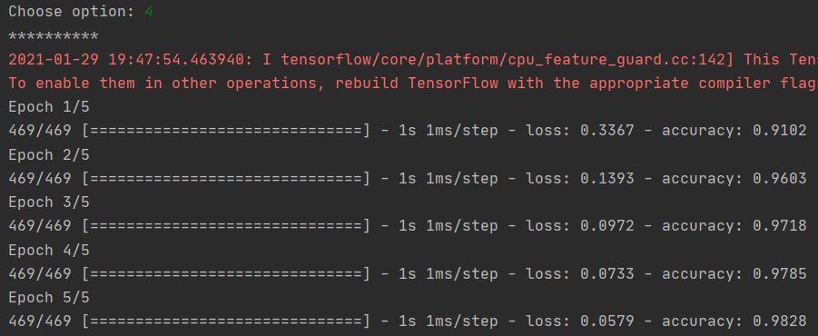
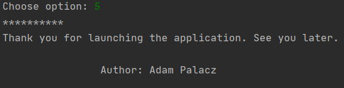

# Guess_the_number_with_Keras
Small application using easy neural network based on Keras library to guess by computer the number imputed from user by Paint App created in Tkinker. Right now correctness of the answer is medium (probably 60-70%) depending on accuracy drawn number.

# Interface
Application interface is located in main_app.py. Interface provides us 5 options:

### 1. Show available test numbers
Show all available images numbers from mnist library which we can test our model.(test number is that same as number in test image)
In function show_test_numbers we have commented option showing all dataframe rows (9999 numbers!) 

### 2. Test model using test number
Choose index number from mnist test data and test correctness trained model.
We will get error information if our input isn't a number or that number isn't in range 0-999 corresponding test label index.
If our input is correct we get test_model function result which takes imputed mnist test image label and return
guessed number from our model. Function also plot image chosen label.

### 3. Test model using painted number
Main option. 
Appers paint app windows created in Tkinker where we can paint a number.
To proceed properly we have to click on save button and X button to close window.

After that we get information about number guessed by computer(trained model)

*Important! Correctness of the answer is medium (probably 60-70%) depending on accuracy drawn number.  
It is probably caused by low quality number saved image in Tkinker (Drawn lines are diffrent on saved image. We can see that after saving image in main folder as "image.png")
To increase success rate propably we should correct paint app and/or strengthen trained model (to do in future)

### 4. Train new model.
Train new model recognizing numbers based on neural network and Keras library.
Training process can take few seconds depending on user's processor.

*We get warrning from Tensorflow about required updating but it does not affect the model.

### 5. End Program 
Program is ending and we get farewell information.

